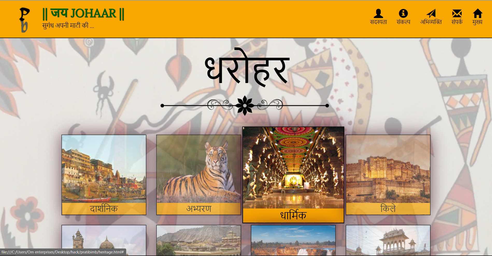

# **_Pratibimb_ ⚡️**

##**This is the project. which aims to showcase the various heritage of our country 🛕.**

### This project is about the Indian culture which tells you about  धरोहर,  साहित्य , संस्कृति , कला.
 

# Technologies used for this project

1) _HTML is required_
2) _CSS (Cascading style sheet)_
3) _Basic JAVASCRIPT is used_
4) _Node modules (NPM) is used_
5) _HTML, CSS and JAVASCRIPT framework, BOOTSTRAP are used in this project._
6) _Basic jQuery is used_

